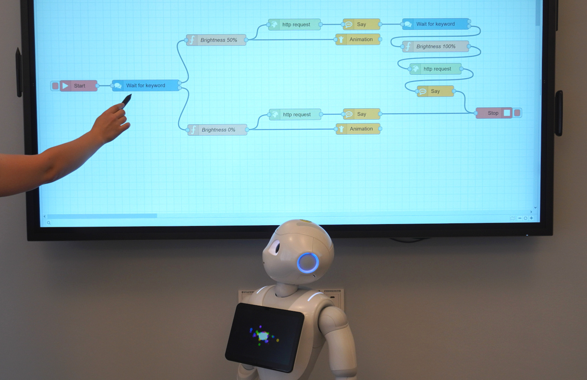
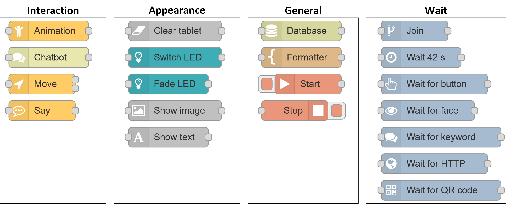
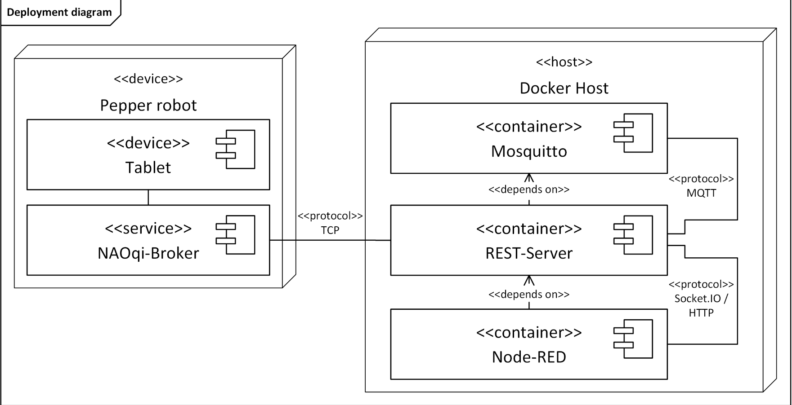

# Node-(RED)<sup>2</sup> - Node-RED-based Robotics Empowerment Designer <!-- omit from toc -->
<div align="center">
  
</div>

## Table of Contents <!-- omit from toc -->
- [About the project](#about-the-project)
- [Key components](#key-components)
- [Getting Started](#getting-started)
  - [Limitations](#limitations)
  - [Prerequisites](#prerequisites)
  - [Installation](#installation)
- [Usage](#usage)
  - [Node list](#node-list)
  - [Node documentation](#node-documentation)
- [Architecture](#architecture)
  - [Pepper robot](#pepper-robot)
  - [Docker Host](#docker-host)
- [Troubleshooting](#troubleshooting)
  - [Known/Typical issues](#knowntypical-issues)
- [Contributing](#contributing)
- [License](#license)

## About the project
Node-(RED)<sup>2</sup> is a self-hosted web application designed to allow even untrained users to easily create and configure scenarios for the humanoid robot Pepper from Aldebaran Robotics. Using custom nodes and flow control, this project leverages and extends the capabilities of [Node-RED](https://nodered.org/) as a low-code (visual) programming environment.

With Node-RED the user will be able to easily create and configure scenarios for the robot, subsequently referred to as *flows*. To enable even non-technical users to use the system, we have deliberately made some fundamental changes to Node-RED. Therefore, we have moved away from the original event-based approach of how flows are started and stopped in Node-RED. In Node-(RED)<sup>2</sup> the user has to define a clear start and end to a flow with the respective *Start*- and *Stop*-nodes. This not only is a means of organization and intuitive This allows the user to start or stop a flow at any time.

> **Note**:
> This application was referenced in the paper ***Weike, M., Ruske, K., Gerndt, R. & Doernbach, T., 2024. Enabling Untrained Users to Shape Real-World Robot Behavior Using an Intuitive Visual Programming Tool in Human-Robot Interaction Scenarios, in International Symposium on Technological Advances in Human-Robot Interaction***.

## Key components
- [Node-RED](https://nodered.org/)
- [libqi-python](https://github.com/aldebaran/libqi-python)
- [Flask](https://github.com/pallets/flask/)

## Getting Started
### Limitations
This project uses the official [Python bindings](https://github.com/aldebaran/libqi-python) from aldebaran in order to control the robot. These bindings currently provide Python wheels only for x86-based systems and only up to Python 3.5. Releases AFTER version 1.0 will be supplied with a self-compiled Wheel for Python 3.10 (tested on Ubuntu 22.04).

Furthermore, this project is still in its early stages and should therefore only be used in secure local networks. In its current state, it should NEVER be accessible on public networks.
### Prerequisites
- Pepper robot running NAOqi 2.5.10.7 (QiSDK [NAOqi 2.9] is **not** supported)
- Ubuntu 22.04/Debian Bullseye (other flavours will probably work, but weren't tested)
- Docker and Docker-Compose

### Installation
1. Clone the repository
```sh
  git clone https://github.com/Robotics-Empowerment-Designer/RED-Platform.git
  cd node-red-standalone
```

2. Prepare the script and run it
```sh
  chmod +x combine.sh
  ./combine.sh
```

3. Select the robots you want to use (currently only Pepper is supported)

4. After the installation is finished, a configuration wizard to set IPs, ports and other settings should start automatically.

5. Should any of the operations fail the script will exit. Create an issue if you can't make it work and include the line that it failed on as well as any additional error messages.

6. After the initial setup is finished, the application will start automatically. If you want to start it afterwards **DO NOT** rerun the script, you need to use the following command:
```sh
  docker compose up
```

<br/>

> **Note:**
> The following documentation assumes that you're using the default port. If you changed the port in the configuration wizard you need to use the respective port instead.

The application should now be running and both the log as well as the debug page (under `http://<flask-ip>:5000` or [http://localhost:5000](http://localhost:5000)) should show `Connection type: Real robot`. If that isn't the case and it says `Connection type: disconnected` the application is running but a connection with the robot couldn't be established. Take a look at the [troubleshooting](#troubleshooting) section for more information.

## Usage
<div align="center">

  

</div>

<div align="center">
  <p align="center">Creation of a simple flow.</p>
</div>

1. Open Node-RED in your browser (`http://<flask-ip>:1880`, or [http://localhost:1880](http://localhost:1880)).
2. Drag a *Start*- and a *Stop*-node in your workspace (every flow **needs** exactly one *Start*-node and at least one *Stop*-node).
3. Implement your scenario with the other nodes.
   1. Wire up the nodes using the grey connectors as shown in the previous video.
   2. You can configure any node with a double-click on the respective node.
4. Deploy your scenario (red button in the top-right corner).
5. Start your flow (red square of the *Start*-node).

### Node list
The following figure shows all 20 currently implemented nodes. Each node has a detailed documentation which is integrated directly into Node-RED. Alternatively, the markdown can be viewed at [/node-red/nodes/\<name>/locales/\<language>/\<name>.html](./node-red/nodes/).
<div align="center">
  
</div>

### Node documentation
As already mentioned, each of our nodes is documented.  This documentation is available in two different versions, a short version which can be opened by hovering over a node in the node list or the detailed version which can be opened with the shortcut `CTRL+G H`.
## Architecture
<div align="center">
  
</div>

[comment]: # (Pepper.py aus Diagramm entfernen)
### Pepper robot
The robot consists of two separate systems: the NAOqi broker, which we use to trigger actions on the robot (i.e. to play an animation), and the tablet, which is running Android 5.1.  The only way to programmatically interact with the tablet is through the NAOqi-Broker, which limits the usefulness of the tablet (e.g. it's not possible to detect specific touch events of the tablet or to serve custom web pages that include javascript).

In previous versions, it was necessary to have a custom script ([pepper.py](/pepper/pepper.py)) running on the robot at all times. This was because the recommended way of listening to the robot's events (i.e. face/speech/touch detection) did not work due to a protocol break in libQi. Hence we had to redirect events from the robot to our application. In newer versions (> 1.0) this is no longer necessary.
### Docker Host
The Docker host consists of three main containers: REST-Server, Node-RED and Mosquitto. The REST-Server container contains a Flask WSGI application that in turn exposes our API, which is mainly called by Node-RED. Additionally, it contains a debug page that lists useful information and some quick actions from the robot.

Node-RED acts as a frontend and is mostly responsible for the correct timing of the API calls. Node-RED and our Flask application communicate over Socket.IO (as well as some HTTP calls for configuration information).
> **Note:**
> Because we use docker it is important to note, that any changes you make to files inside of the container will only be persistent if this change happens inside of a mapped volume (can be seen in [docker-compose.yml](docker-compose.yml)). Should you make changes to dependencies (i.e. in [/rest-server/requirements.txt](/rest-server/requirements.txt)) you need to rebuild the images with the aforementioned `buildContainer.sh` script.

## Troubleshooting
Should you encounter issues (i.e. you start a flow but the robot doesn't perform any actions) the best place to start would be the .log file under `/rest-server/<robot-name>.log`. In there you should be able to find some pointers to your issues in the form of warning and error messages.

### Known/Typical issues
1. **My robot doesn't do anything!** <br>
  Make sure your robot is connected to our application. You can check this through the debug site ([localhost:5000](localhost:5000)) or in the log file for `Connection type: Real robot` or `Connection type: Disconnected`. If your robot is not connected to our application make sure that both the system that our application is running on as well as the robot (**both** the robot and the tablet!) are in the same network. Next you should make sure that the robot ip you configured in [.env](./.env)-file is still valid (briefly press the button behind the tablet on peppers chest to get the robot ip). If you're running this project inside of a VM, make sure to use a network bridge instead of NAT.
2. **After some time the robot doesn't do anything anymore!** <br>
  This is probably caused by one of the following two problems: either your network has connection issues (characterizes by longer processing time for e.g. speech recognition) or the libqi-python library tries to spawn a new thread which causes our application to lose connection to the robot and (currently) be in an unrecoverable state. Should the latter be the case you need to restart the application and refresh Node-RED in your browser.
3. **I can't install your application!** <br>
  This is most likely because you're either trying to install our application on Windows or on an arm-based system (e.g. newer Macs, Raspberry Pi). On Windows you should be able to adapt the [buildContainers.sh](./buildContainers.sh) script or perhaps run it through the WSL. As for the arm-based systems you'll need to combile the libqi-python library yourself. You use find a step-by-step guide [here](./CONTRIBUTING.md#test) (feel free to create a pull request in case you're successful). 

## Contributing
We welcome any contributions (improvements, bug fixes, new features or even additional robot support), just create a pull request!
Additionally we've created a short [contribution guide](./CONTRIBUTING.md). There you can find instructions on how to create your own nodes for this project as well as additional information on how to create issues an pull requests.

[comment]: # (Kurzanleitung zur Erstellung/Anbindung von Nodes)

[comment]: # (Links)
[NodeRED-url]: https://nodered.org/

## License
This project is licensed under the Apache 2 License - see [LICENSE](/LICENSE) for details
